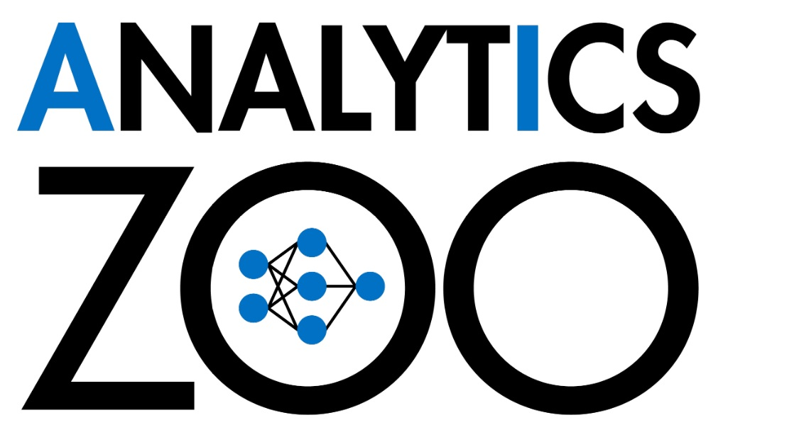

<div align="center">

<p align="center"> <br></p>

**An open source _Big Data AI_ platform**<br>
**for distributed TensorFlow, PyTorch and keras on Apache Spark & Ray**

</div>

---

Analytics Zoo includes the following libraries for scaling end-to-end AI to distributed Big Data: 

 - [Orca](https://analytics-zoo.readthedocs.io/): seamlessly scaling out TensorFlow, PyTorch and Keras programs for distributed Big Data
 - [Zouwu](): salable time series analysis using AutoML 
 - [RayOnSpark](): running Ray programs directly on Big Data platform

For more information, you may [read the docs](https://analytics-zoo.readthedocs.io/).

---

## Installing
You can use Analytics Zoo on [Google Colab]() without any installation. Analytics Zoo also includes a set of [notebooks]() that you can directly open and run in Colab.

To install Analytics Zoo, we recommend using [conda](https://docs.conda.io/projects/conda/en/latest/user-guide/install/)  environments.

```bash
conda create -n my_env 
conda activate my_env
pip install analytics-zoo 
```

To install latest nightly build, use ```pip install --pre analytics-zoo```; see [Python](https://analytics-zoo.readthedocs.io/en/latest/doc/UserGuide/python.html)  and [Scala](https://analytics-zoo.readthedocs.io/en/latest/doc/UserGuide/scala.html) user guide for more details.

## Getting Started with Orca

Most AI projects start with a Python notebook running on a single laptop; however, one usually needs to go through a mountain of pains to scale it to handle larger data set in a distributed fashion. The  **Orca**  library seamlessly scales out your single node Python notebook across large clusters (so as to process distributed Big Data).

First, initialize [Orca Context]():

```python
from zoo.orca import init_orca_context

#cluster_mode can be "local" or "k8s" or "yarn"
sc = init_orca_context(cluster_mode="yarn", cores=4, memory="10g", num_nodes=2) 
```

Next, perform [data-parallel processing in Orca](https://analytics-zoo.readthedocs.io/en/latest/doc/Orca/Overview/data-parallel-processing.html) (using standard Spark Dataframes, TensorFlow Dataset, PyTorch DataLoader, Pandas, etc.):

```python
from pyspark.sql.functions import array

df = spark.read.parquet(file_path)
df = df.withColumn('user', array('user')) \  
    .withColumn('item', array('item'))
```

Finally, use [sklearn-style Estimator APIs in Orca](https://analytics-zoo.readthedocs.io/en/latest/doc/Orca/Overview/distributed-training-inference.html) to perform distributed TensorFlow, PyTorch or Keras training and inference:

```python
from tensorflow import keras
from zoo.orca.learn.tf.estimator import Estimator

user = keras.layers.Input(shape=[1])  
item = keras.layers.Input(shape=[1])  
feat = keras.layers.concatenate([user, item], axis=1)  
predictions = keras.layers.Dense(2, activation='softmax')(feat)  
model = keras.models.Model(inputs=[user, item], outputs=predictions)  

model.compile(optimizer='rmsprop',  
  loss='sparse_categorical_crossentropy',  
  metrics=['accuracy'])

est = Estimator.from_keras(keras_model=model)  
est.fit(data=df,  
        batch_size=64,  
        epochs=4,  
        feature_cols=['user', 'item'],  
        label_cols=['label'])
```

See [TensorFlow 1.15](https://analytics-zoo.readthedocs.io/en/latest/doc/Orca/QuickStart/orca-tf-quickstart.html), [Keras 2.3](https://analytics-zoo.readthedocs.io/en/latest/doc/Orca/QuickStart/orca-keras-quickstart.html), [PyTorch](https://analytics-zoo.readthedocs.io/en/latest/doc/Orca/QuickStart/orca-pytorch-quickstart.html) and [TensorFlow 2.x]() quick start for more details.

## Getting Started with Zouwu

Time series prediction takes observations from previous time steps as input and predicts the values at future time steps. The **Zouwu** library makes it easy to build end-to-end time series analysis by applying AutoML to extremely large-scale time series prediction.

See the Zouwu [quick start]() and [user guide]() for more details.

## Getting Started with RayOnSpark

Ray is an open source distributed framework for emerging AI applications. **RayOnSpark** allows users to directly run Ray programs on their existing Big Data clusters; it also allows Ray applications to seamlessly integrate into Big Data processing pipeline and directly process in-memory Spark RDDs or DataFrames.

See the RayOnSpark [quick start]() and [user guide]() for more details.

## More information

- [Document Website](https://analytics-zoo.readthedocs.io/)
- [Mail List](mailto:bigdl-user-group+subscribe@googlegroups.com)
- [User Group](https://groups.google.com/forum/#!forum/bigdl-user-group)
- [Powered-By]()
- [Presentations]()

_Older Documents_
- [BigDL Paper](https://arxiv.org/abs/1804.05839)
- [Documentation (old)](https://analytics-zoo.github.io/)
