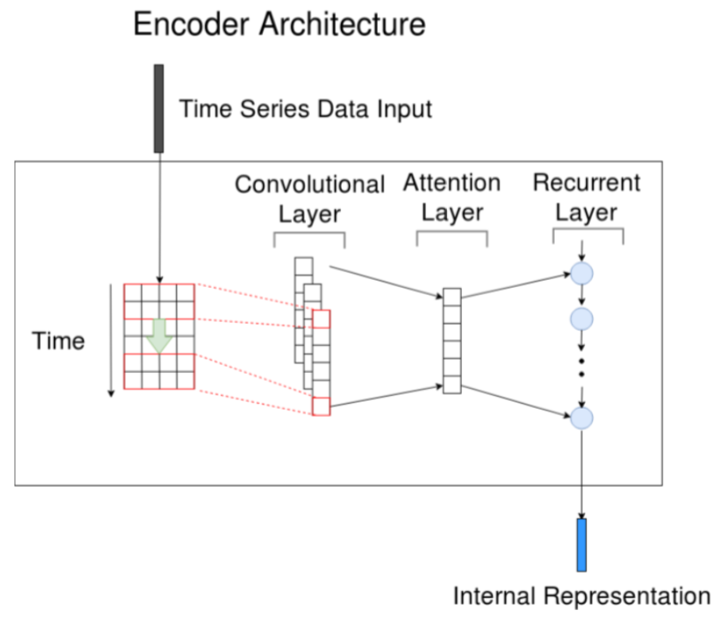

# MTNet Algorithm

As we have mentioned before, MTNet is a memory-network based solution for multivariate time-series forecasting. The input data has a form of time series signal with several variables observed in each time stamp. Input data is divided into two parts, long-term historical data **{X_i}** and a short-term data series **Q**. Long-term historical data typically has several data series and each of them has the same length of the short-term data series.

One of the main modules of MTNet is its Encoder. It composes of three parts, a convolutional layer, an attention layer and a recurrent layer. For the convolutional layer, we have `cnn_hid_size` filters with width as the number of input feature `feature_dim` and height as `cnn_height`.  Then the convolution output is sent to a recurrent neural network with attention mechanism. You can have several RNN layers and the units number is set in `rnn_hid_size` The recurrent neural network is implemented as a GRU in this case.

As we have mentioned before, MTNet has two input, long-term historical data **{X_i}** and a short-term data series **Q**. The length of each long-term historical data series and the short-term data series is `series_length` and there are `long_series_num`  long-term historical data series in all (typically 7 as shown in this flow chart). Each **X_i** in **{X_i}** is encoded by the encoder to get `long_series_num` input memory representations **{m_i}**. Short-term data series is encoded by the encoder to get a query vector **u**.  By inner product between each **m_i** in **{m_i}** with **u** and a SoftMax operation, we get an attention weight distribution vector. The attention weight distribution vector is then element-wise multiplied by another encoded  representation **{c_i}** and get a weighted output **{o_i}**. The weighted output is concatenated with the query vector **u** and sent through a fully connected layer with output dimension as `target_dim`.

There is another auxiliary autoregressive model works independently. The autoregressive model assumes that the value to be forecasted is relevant to its previous value. `ar_window_size` states the number of previous value you want to use in the regression. The output feature number is also `target_dim`.

At last, the autoregressive model result is added with the memory network result to get the final time series prediction.

You can find API instructions [here](../API/MTNetForecaster.md).

## Reference

Yen-YuChang, Fan-YunSun, Yueh-HuaWu, Shou-DeLin,  [A Memory-Network Based Solution for Multivariate Time-Series Forecasting](https://arxiv.org/abs/1809.02105). 

