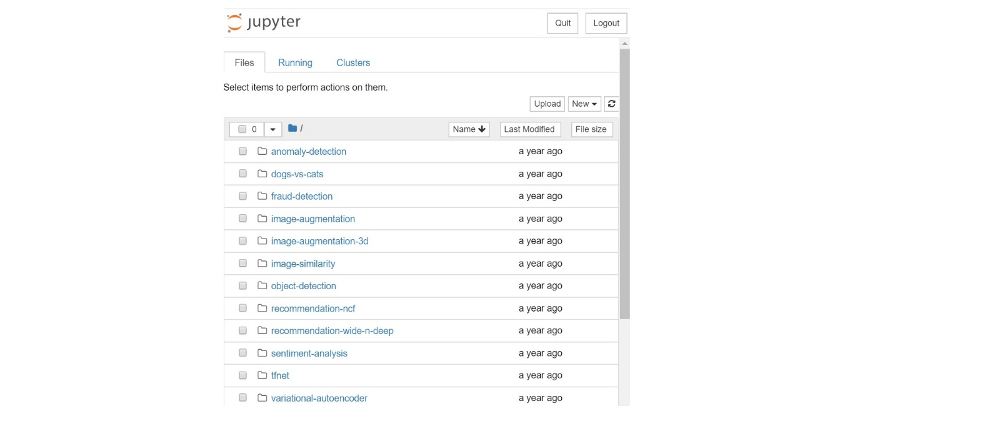
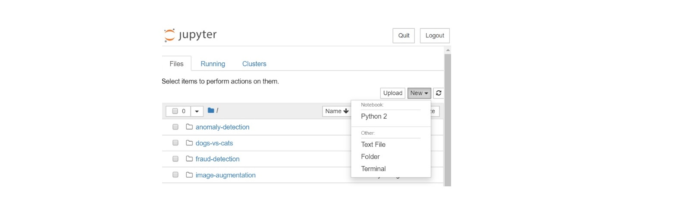
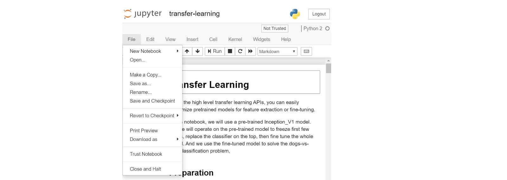

# Analytics Zoo Docker User Guide 

In order to simply the Analytics Zoo installation and configuration, Analytics Zoo docker images have been built and provided on Docker Hub. These docker images have been pre-built with all the dependencies and readily configured to run a bunch of Analytics Zoo examples out-of-box. The pre-installed packages are listed at the end of this page. 

With an Analytics Zoo docker image, users can run Analytics Zoo examples on Linux (such as Ubuntu, CentOS), MacOS and Windows. Users can choose to run the Analytics Zoo examples within the container environment as a local mode, or submit the Analytics Zoo task from the container environment to a remote Spark cluster. 

Users can also develop their own Data Analytics or AI applications using Analytics Zoo within Jupyter Notebook, either by starting with a blank Python template in the Jupyter Notebook, or cloning & modifying upon the various Analytics Zoo examples provided in the docker.

This document provides step-by-step instructions for users to easily start using the Analytics Zoo docker:

* [Launch an Analytics Zoo Docker Container](#Launch-an-Analytics-Zoo-Docker-Container)
* [Run Analytics Zoo Jupyter Notebook example in a container](#Run-Analytics-Zoo-Jupyter-Notebook-example-in-a-container)
    - [Start the Jupyter Notebook service in the container](#Start-the-Jupyter-Notebook-service-in-the-container)
    - [Connect to Jupyter Notebook Service](#Connect-to-Jupyter-Notebook-Service)
    - [Run Analytics Zoo Jupyter Notebook examples](#Run-Analytics-Zoo-Jupyter-Notebook-examples)
    - [Create a new Analytics Zoo Jupyter Notebook example](#Create-a-new-Analytics-Zoo-Jupyter-Notebook-example)
* [Submit Jupyter Notebook example from container to remote Spark cluster](#Submit-Jupyter-Notebook-example-from-container-to-remote-Spark-cluster)
* [Terminate the Analytics Zoo Docker Container](#Terminate-the-Analytics-Zoo-Docker-Container)
* [Build A Customized Analytics Zoo Docker Image](#Build-A-Customized-Analytics-Zoo-Docker-Image)


## Launch an Analytics Zoo Docker Container

A Linux user (CentOS or Ubuntu) can pull a docker image and launch the docker container with one command line. 

#### Getting Ready

1. Fresh install OS such as Linux OS (CentOS, Ubuntu etc), MacOS or Windows.
2. Download and Install Docker following the instructions on: 
https://docs.docker.com/get-docker/
3. Pull an Analytics Zoo docker image (optional)
It is optional to pull an Analytics Zoo docker image in advance, as the command “docker run” in [“Launch Analytics Zoo Docker Container”](#Launch-Analytics-Zoo-Docker-Container) step will check the availability of the docker image and pull the image if it is absent. For example, to pull the latest docker image in advance, use: 
```
sudo docker pull intelanalytics/analytics-zoo:latest
```

#### Launch Analytics Zoo Docker Container

Launch an Analytics Zoo docker container with this command line: 
```
$sudo docker run -it --rm --net=host -e NotebookPort=12345 -e NotebookToken="your-token" intelanalytics/analytics-zoo:latest bash
```
* The value 12345 is a user specified port number. 
* The value "your-token" is a user specified string.

If you want to specify an Analytics Zoo version, for example 0.7.0, use: 
```
sudo docker run -it --rm --net=host \
    -e NotebookPort=12345 \
    -e NotebookToken="your-token" \
    intelanalytics/analytics-zoo:0.7.0-bigdl_0.10.0-spark_2.4.3 bash
```

If you need to use http/https proxy, use:  
```
sudo docker run -it --rm --net=host \
    -e NotebookPort=12345 \
    -e NotebookToken="your-token" \
    -e http_proxy=http://your-proxy-host:your-proxy-port \
    -e https_proxy=https://your-proxy-host:your-proxy-port \
    intelanalytics/analytics-zoo:default bash
```

Once the container is sucessfully launched, you will automatically login to the container and see this as the output: 
```
root@[hostname]:/opt/work#
```

## Run Analytics Zoo Jupyter Notebook example in a container

This section depends on the previous section [“Launch Analytics Zoo Docker Container”](#Launch-Analytics-Zoo-Docker-Container). After the user launches the Analytics Zoo docker container, the Jupyter Notebook service can be started and Analytics Zoo jupyter examples are available. 

### Start the Jupyter Notebook service in the container

After a docker container is launched and user login to the container, user can start the Jupyter Notebook service inside the container. 

#### Start Jupyter Notebook service in the container

In the /opt/work directory, run this command line to start the Jupyter Notebook service:
```
#start-notebook.sh
```

As a result, you will see the output message like below. This means the Jupyter Notebook service has started successfully within the container.
```
[I 01:04:45.625 NotebookApp] Serving notebooks from local directory: /opt/work/analytics-zoo-0.5.0-SNAPSHOT/apps
[I 01:04:45.625 NotebookApp] The Jupyter Notebook is running at:
[I 01:04:45.625 NotebookApp] http://(the-host-name or 127.0.0.1):12345/?token=...
[I 01:04:45.625 NotebookApp] Use Control-C to stop this server and shut down all kernels (twice to skip confirmation).
```

### Connect to Jupyter Notebook Service
After the Jupyter Notebook service is successfully started, users can connect to the Jupyter Notebook service from a browser. 

#### Connect to the Jupyter Notebook service from a browser
1. Get the IP address of the container
2. Launch a browser, and connect to the Jupyter Notebook service with the URL: 
https://container-ip-address:port-number/?token=your-token

As a result, you will see the Jupyter Notebook like this: 



### Run Analytics Zoo Jupyter Notebook examples
After connecting to the Jupyter Notebook in the browser, users can run multiple Analytics Zoo Jupyter Notebook examples. The example shown below is the “dogs-vs-cats”. 

#### Run Analytics Zoo example with Jupyter Notebook


### Create a new Analytics Zoo Jupyter Notebook example
There are a few ways to quickly start creating a new Analytics Zoo Jupyter Notebook example. Users can “New” a Python notebook from scratch, or use the existing Jupyter Notebook example as an template and modify based on it. 

#### “New” a Jupyter Notebook and write Analytics Zoo code from scratch
Once the user is connected to the Jupyter Notebook service and opens the address in a browser, the user can instantly click the “New” button and start creating a Python notebook example in the existing Analytics Zoo Jupyter Notebook folder. 



#### “Make a Copy” from an existing Analytics Zoo Jupyter Notebook example and model after it
The user can also select an existing Analytics Zoo Jupyter Notebook example approximating to his own use case, then make a copy and start tailing it. 



## Submit Jupyter Notebook example from container to remote Spark cluster

Users can choose to run Analytics Zoo Jupyter Notebook from a container environment but leverage a remote Spark cluster. 

#### Launch Jupyter Notebook service from container, and specify a remote Spark cluster
Specify a remote Spark cluster when launching an Analytics Zoo docker container with this command line: 
```
sudo docker run -itd --net=host \
    -e NotebookPort=12345 \
    -e NotebookToken="your-boken" \
    -e http_proxy=http://your-proxy-host:your-proxy-port  \
    -e https_proxy=https://your-proxy-host:your-proxy-port  \
    -e RUNTIME_SPARK_MASTER=spark://your-spark-master-host:your-spark-master-port \
    -e RUNTIME_DRIVER_CORES=4 \
    -e RUNTIME_DRIVER_MEMORY=20g \
    -e RUNTIME_EXECUTOR_CORES=4 \
    -e RUNTIME_EXECUTOR_MEMORY=20g \
    -e RUNTIME_TOTAL_EXECUTOR_CORES=4 \
    intelanalytics/analytics-zoo:latest bash
```

The “RUNTIME_SPARK_MASTER” is used to specify the remote Spark cluster address: 
```
RUNTIME_SPARK_MASTER=spark://your-spark-master-host:your-spark-master-port 
```

These additional parameters are used to specify Spark configurations:  
```
    -e RUNTIME_DRIVER_CORES=4 \
    -e RUNTIME_DRIVER_MEMORY=20g \
    -e RUNTIME_EXECUTOR_CORES=4 \
    -e RUNTIME_EXECUTOR_MEMORY=20g \
    -e RUNTIME_TOTAL_EXECUTOR_CORES=4 \
```

#### Run the Jupyter Notebook example on the remote Spark cluster
Follow the same steps in section [“Connect to Jupyter Notebook Service”](#Connect-to-Jupyter-Notebook-Service) to interactively run the Analytics Zoo Jupyter Notebook. The execution will be distributed to the Spark cluster. 

## Terminate the Analytics Zoo Docker Container
Users should terminate the Analytics Zoo docker container done using it. 

#### Terminate the Analytics Zoo Docker Container
A user can list all the active docker containers by command line: 
```
$sudo docker ps
```

As a result, your docker container should be shown like: 
```
CONTAINER ID        IMAGE                                        COMMAND                  CREATED             STATUS              PORTS               NAMES
40de2cdad025        intelanalytics/analytics-zoo:latest          "/opt/work/start-n..."   3 hours ago         Up 3 hours                               upbeat_al  
```

Terminate the corresponding docker container by its ID: 
```
$sudo docker rm -f 40de2cdad025        
```

## Build A Customized Analytics Zoo Docker Image
A set of pre-build Analytics Zoo docker images have been provided on the [Docker Hub](!https://hub.docker.com/r/intelanalytics/analytics-zoo/tags?page=1&ordering=last_updated). Users can retrieve these docker images by  “docker pull” command and specify a tag for which docker image to download. For example: 
```
sudo docker pull intelanalytics/analytics-zoo:0.7.0-bigdl_0.10.0-spark_2.4.3
sudo docker pull intelanalytics/analytics-zoo:latest 
```

It is recommended to use a pre-build docker image on the Docker Hub. However you can build or customize an Analytics Zoo docker image if you do need to do so. For example: 

* Build an Analytics Zoo docker image with latest Analytics Zoo nightly build: 
```
sudo docker build --rm -t intelanalytics/analytics-zoo:default . 
```

* Build with http/https proxy: 
```
sudo docker build \
    --build-arg http_proxy=http://your-proxy-host:your-proxy-port \
    --build-arg https_proxy=https://your-proxy-host:your-proxy-port \
    --rm -t intelanalytics/analytics-zoo:default .
```

* Build with specific Analytics Zoo version, BigDL version or Spark version:
```
sudo docker build \
    --build-arg ANALYTICS_ZOO_VERSION=0.3.0 \
    --build-arg BIGDL_VERSION=0.6.0 \
    --build-arg SPARK_VERSION=2.3.1 \
    --rm -t intelanalytics/analytics-zoo:0.3.0-bigdl_0.6.0-spark_2.3.1 .
```

## Pre-installed Packages

The Analytics-Zoo docker images have been pre-built with below packages:
* git
* maven
* Oracle jdk 1.8.0_152 (in /opt/jdk1.8.0_152)
* python 3.6.9
* pip
* numpy
* scipy
* pandas
* scikit-learn
* matplotlib
* seaborn
* jupyter
* wordcloud
* moviepy
* requests
* tensorflow
* spark-${SPARK_VERSION} (in /opt/work/spark-${SPARK_VERSION})
* Analytics-Zoo distribution (in /opt/work/analytics-zoo-${ANALYTICS_ZOO_VERSION})
* Analytics-Zoo source code (in /opt/work/analytics-zoo)


