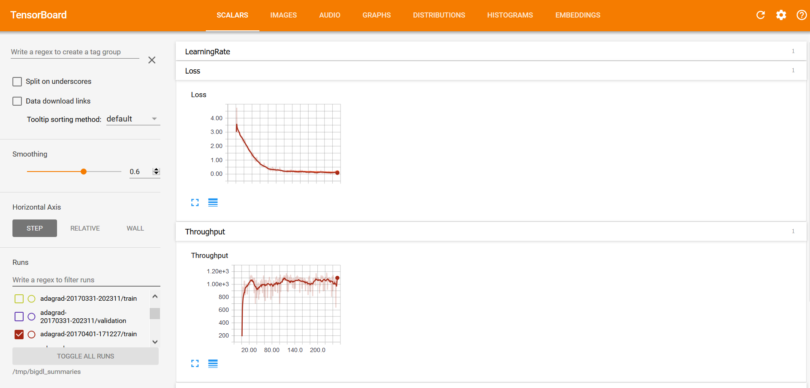

# *Enable visualization*
To enable visualization support, you need first properly configure to collect statistics summary in different stages of training. It should be done before the training starts. See examples below: 
## **Generating summary in NNEstimator**

## **Generating summary in KerasAPI**

# *Visualization*
## **Retrieving summary from TrainSummary and ValidationSummary**

You can use provided API `readScalar`(Scala) and `read_scalar`(Python) to retrieve the summaries into readable format, and export them to other tools for further analysis or visualization.

_**Example: Reading summary info in Scala**_
```scala
val trainLoss = trainSummary.readScalar("Loss")
val validationLoss = validationSummary.readScalar("Loss")
...
```

_**Example: Reading summary info in Python**_
```python
loss = np.array(train_summary.read_scalar('Loss'))
valloss = np.array(val_summary.read_scalar('Loss'))
...
```

If your training job has finished and existed, but another visualize program wants retrieving summary with 'readScalar'(`read_scalar` in python) API. 
You can re-create the TrainingSummary and ValidationSummary with the same `logDir` and `appName` in your training job. 

---

## **Visualizing training with TensorBoard**
With the summary info generated, we can then use [TensorBoard](https://pypi.python.org/pypi/tensorboard) to visualize the behaviors of the BigDL program.  

* **Installing TensorBoard**

Prerequisites:

1. Python verison: 2.7, 3.4, 3.5, or 3.6
2. Pip version >= 9.0.1
3. tensorflow 1.13.1

* **Launching TensorBoard**

***Loading from  local directory***

You can launch TensorBoard using the command below:
```bash
tensorboard --logdir=[logdir path]
```
After that, navigate to the TensorBoard dashboard using a browser. You can find the URL in the console output after TensorBoard is successfully launched; by default the URL is http://your_node:6006

***Loading from HDFS***
If the logdir is a HDFS folder, you need to configure the HDFS environment before running `tensorboard`.  
Prerequisites:
1. Java >= 1.8, set env JAVA_HOME 
2. Hadoop >= 2.7, set env HADOOP_HOME

Set env before running `tensorboard`:
```
export JAVA_HOME=
export HADOOP_HOME=
source ${HADOOP_HOME}/libexec/hadoop-config.sh
export LD_LIBRARY_PATH=${LD_LIBRARY_PATH}:${JAVA_HOME}/jre/lib/amd64/server
```
If the Hadoop cluster is in secure mode, also set the environment variable `KRB5CCNAME`:
```
export KRB5CCNAME={Path of Kerberos ticket cache file}
```
Run tensorboard, for example:
```
CLASSPATH=$(${HADOOP_HOME}/bin/hadoop classpath --glob) tensorboard --logdir=hdfs://[ip:port]/[hdfs path]
```


* **Visualizations in TensorBoard**

Within the TensorBoard dashboard, you will be able to read the visualizations of each run, including the “Loss” and “Throughput” curves under the SCALARS tab (as illustrated below):


And “weights”, “bias”, “gradientWeights” and “gradientBias” under the DISTRIBUTIONS and HISTOGRAMS tabs (as illustrated below):


---

## **Visualizing training with Jupyter notebook**

If you're using Jupyter notebook, you can also draw the training curves using popular plotting tools (e.g. matplotlib) and show the plots inline. 

First, retrieve the summaries as instructed in [Retrieve Summary](#retrieving-summary-info-as-readable-format). The retrieved summary is a list of tuples. Each tuple is a recorded event in format (iteration count, recorded value, timestamp). You can convert it to numpy array or dataframe to plot it. See example below:  

_**Example: Plot the train/validation loss in Jupyter**_

```python
#retrieve train and validation summary object and read the loss data into ndarray's. 
loss = np.array(train_summary.read_scalar("Loss"))
val_loss  = np.array(val_summary.read_scalar("Loss"))

#plot the train and validation curves
# each event data is a tuple in form of (iteration_count, value, timestamp)
plt.plot(loss[:,0],loss[:,1],label='train loss')
plt.plot(val_loss[:,0],val_loss[:,1],label='val loss',color='green')
plt.scatter(val_loss[:,0],val_loss[:,1],color='green')
plt.legend();
```
 


