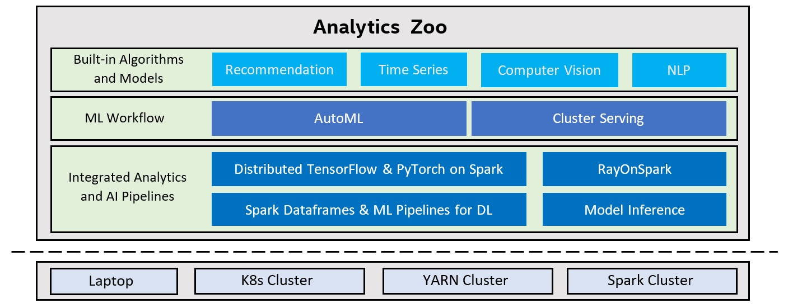

**This is the _OLD_ document website for Analytics Zoo; please visit the new [document website](https://analytics-zoo.readthedocs.io/) instead.**

---

 

_A unified Data Analytics and AI platform for **distributed TensorFlow, Keras and PyTorch on Apache Spark/Flink & Ray**_

---

# <b>What is Analytics Zoo?</b>

Analytics Zoo seamless scales TensorFlow, Keras and PyTorch to distributed big data (using Spark, Flink & Ray).

 

* **End-to-end pipeline for applying AI models (TensorFlow, PyTorch, OpenVINO, etc.) to distributed big data** 
    * Write [TensorFlow](ProgrammingGuide/TFPark/tensorflow.md) or [PyTorch](ProgrammingGuide/pytorch.md) inline with Spark code for distributed training and inference.
    * Native deep learning (TensorFlow/Keras/PyTorch/BigDL) support in [Spark ML](ProgrammingGuide/nnframes.md) Pipelines.
    * Directly run [Ray](ProgrammingGuide/rayonspark.md) programs on big data cluster through _RayOnSpark_. 
    * Plain Java/Python APIs for (TensorFlow/PyTorch/BigDL/OpenVINO) [Model Inference](ProgrammingGuide/inference.md). 

* **High-level ML workflow for automating machine learning tasks**
  - [Cluster Serving](ClusterServingGuide/ProgrammingGuide.md) for automatically distributed (TensorFlow/PyTorch/Caffe/OpenVINO) model inference . 
  - Scalable [AutoML](ProgrammingGuide/AutoML/overview.md) for time series prediction.

- **Built-in models** for [Recommendation](APIGuide/Models/recommendation.md), [Time Series](APIGuide/Models/anomaly-detection.md), [Computer Vision](APIGuide/Models/object-detection.md) and [NLP](APIGuide/Models/text-matching.md) applications.

---

# <b>Why use Analytics Zoo?</b>

You may want to develop your AI solutions using Analytics Zoo if:

* You want to easily apply AI models (e.g., TensorFlow, Keras, PyTorch, BigDL, OpenVINO, etc.) to distributed big data.
* You want to transparently scale your AI applications from a single laptop to large clusters with "zero" code changes.
* You want to deploy your AI pipelines to existing YARN or K8S clusters *WITHOUT* any modifications to the clusters.
* You want to automate the process of applying machine learning (such as feature engineering, hyperparameter tuning, model selection, distributed inference, etc.). 

---

# <b>How to use Analytics Zoo?</b>

* Check out the [Getting Started page](gettingstarted.md) for a quick overview of how to use Analytics Zoo.
* Refer to the [Python](PythonUserGuide/install.md), [Scala](ScalaUserGuide/install.md) and [Docker](DockerUserGuide/index.md) guides to install Analytics Zoo.
* Visit the [Document Website](https://analytics-zoo.github.io/) ([mirror](https://analytics-zoo.gitee.io/) in China) for more information on Analytics Zoo.
* Check the [Powered By](https://analytics-zoo.github.io/master/#powered-by/) & [Presentations](https://analytics-zoo.github.io/master/#presentations/) pages for real-world applications using Analytics Zoo.
* Join the [Google Group](https://groups.google.com/forum/#!forum/bigdl-user-group) (or subscribe to the [Mail List](mailto:bigdl-user-group+subscribe@googlegroups.com)) for more questions and discussions on Analytics Zoo.
