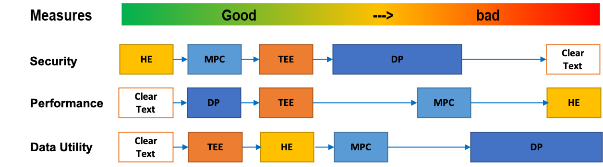
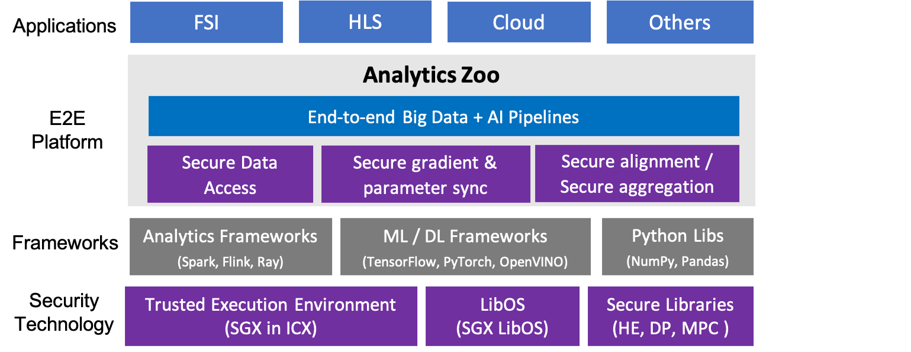

# PPML (Privacy Preserving Machine Learning)

Analytics Zoo provides an end-to-end PPML platform for Big Data AI.

## PPML for Big Data AI

Among most commonly used PPML technologies, i.e., [HE (Homomorphic Encryption)](https://en.wikipedia.org/wiki/Homomorphic_encryption), [MPC (Multi-Party Computation) or SMC (Secure Multi-Party Computation)](https://en.wikipedia.org/wiki/Secure_multi-party_computation), [DP (Differential Privacy)](https://en.wikipedia.org/wiki/Differential_privacy) and [TEE (Trusted Execution Environment)](https://en.wikipedia.org/wiki/Trusted_execution_environment), we choose [Intel SGX (Software Guard Extensions)](https://software.intel.com/content/www/us/en/develop/topics/software-guard-extensions.html), a widely used TEE technology, as our main building block for PPML applications. As shown below, Intel SGX performs well on all measures, including security, performance and utility, and is easy to extend to large scale dataset on [3rd Gen Intel Xeon Scalable](https://newsroom.intel.com/press-kits/3rd-gen-intel-xeon-scalable/).



Based on Intel SGX (Software Guard Extensions) and LibOS projects ([Graphene](https://grapheneproject.io/) and [Occlum](https://occlum.io/)), Analytics-Zoo empowers data scientists and big data developers to build PPML applications on top of large scale dataset without impacting existing applications.



**Key features:**

- Protecting Data and model confidentiality
- Trusted Big Data AI Platform based on Intel SGX

Note: Intel SGX requires hardware support, please [check if your CPU has this feature](https://www.intel.com/content/www/us/en/support/articles/000028173/processors/intel-core-processors.html).

**Scenario:**

- Protecting sensitive input/output data (computation, training and inference) in data application, e.g.,data analysis or machine learning on healthcare dataset.
- Protecting propretary model, e.g., model trained on self-owned data or sensitive data.

## Trusted Big Data Analytics and ML

- Scenario

- Get started

```bash
```

## Trusted Realtime Compute and ML

- Scenario
- Get started

```bash
```

