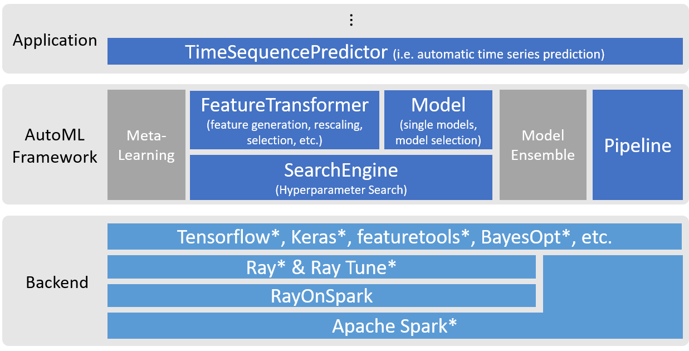

# AutoML
_A distributed **Automated Machine Learning** libary based on **ray** and **tensorflow, pytorch**_

---
The figure below illustrates the architecture of the AutoML framework in Analytics Zoo.

   
  

This library provides a framework and implementations for automatic feature engineering, model selection and hyper parameter optimization. It also provides a built-in automatically optimized model: _**TimeSequencePredictor**_ , which can be used for time series data analysis or anomaly detection. 

For more details about how to use AutoML and API docs, please refer to [Automl Programming Guide](https://analytics-zoo.github.io/master/#ProgrammingGuide/AutoML/forecasting/) and [Automl API Guide](https://analytics-zoo.github.io/master/#APIGuide/AutoML/time-sequence-predictor/)
